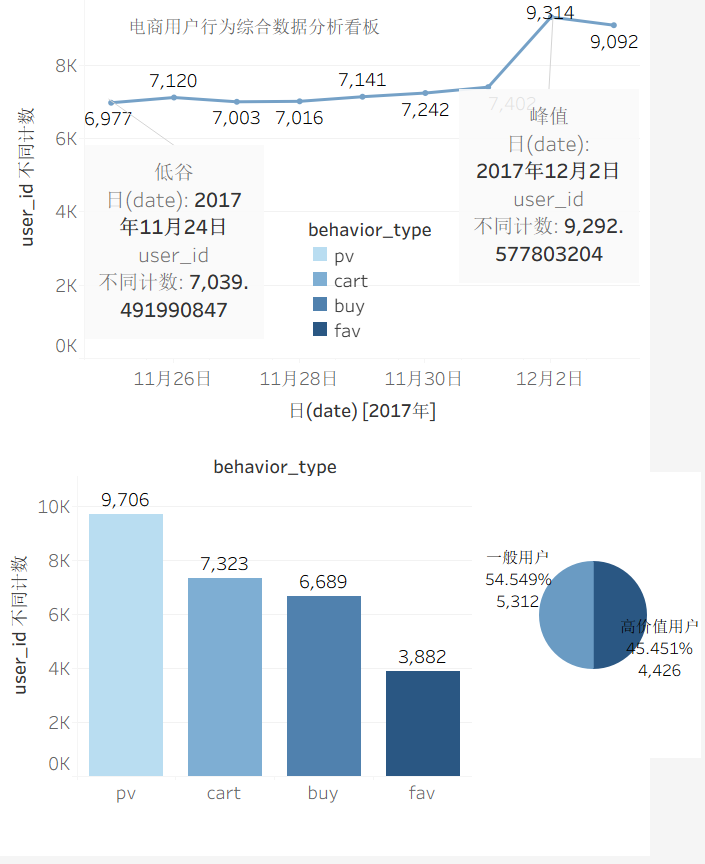
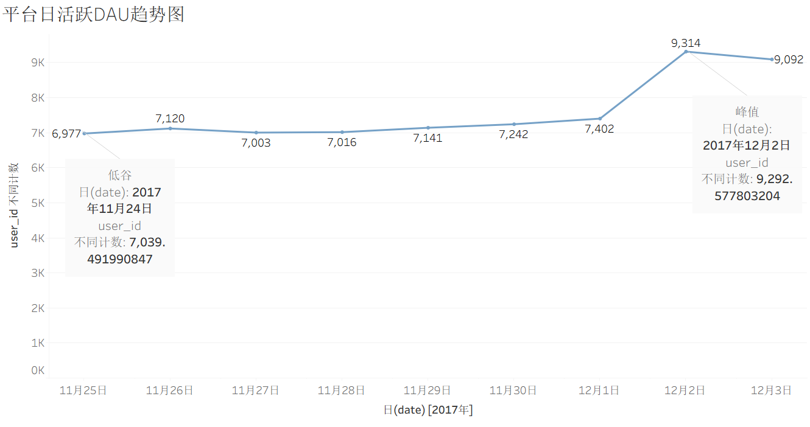
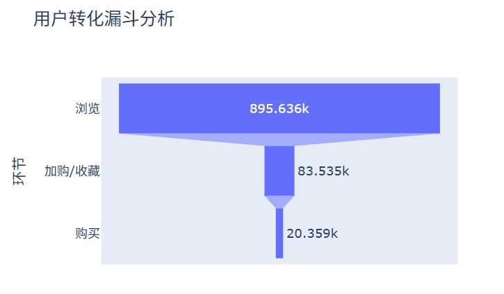
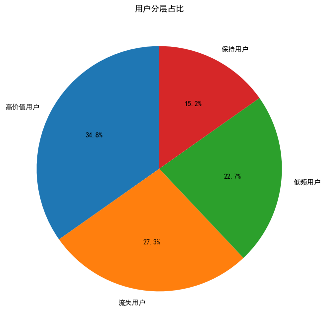
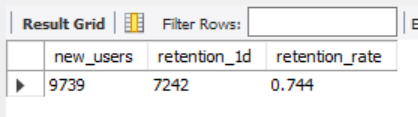
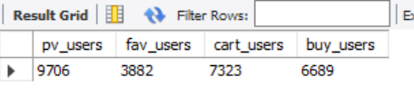
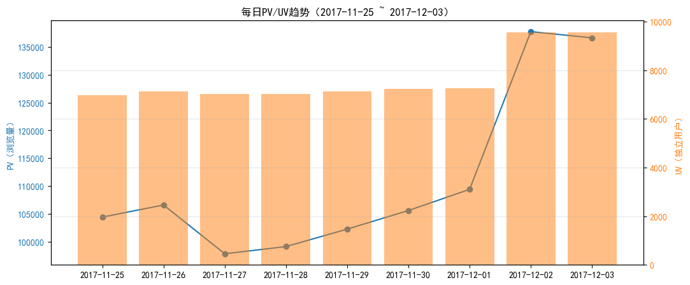
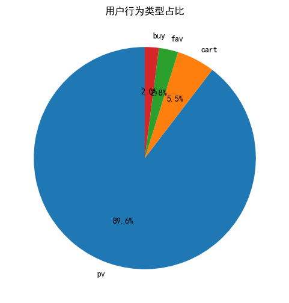

# 电商用户行为数据分析项目

基于阿里天池 UserBehavior 数据集，使用 Python/SQL/Tableau 完成的全流程电商用户行为分析项目。

## 项目亮点
- 数据规模：100万+ 用户行为日志，覆盖浏览、收藏、加购、购买全链路
- 核心模块：用户活跃分析、转化漏斗分析、用户留存分析、RFM 用户分层、A/B Test 验证
- 业务价值：定位平台核心流失环节，提出可落地运营优化策略

## 技术栈
- 数据处理：Python（Pandas、Matplotlib、Scipy）
- 数据分析：MySQL（SQL窗口函数、聚合查询、留存计算）
- 可视化：Tableau（折线图、漏斗图、饼图、综合仪表盘）
- 项目储存：Git

## 项目结构

```
电商用户行为数据分析 /
├── images/ # Tableau 看板与可视化图表（python、sql）
├── python_analysis/ # Python 数据清洗与分析代码
├── sql/ # SQL 业务指标计算脚本及结果
├── README.md # 项目说明文档
└── 电商用户行为分析项目报告.pdf # 完整分析报告
```

## 数据来源与准备

### 1. 数据来源

阿里天池公开数据集 `UserBehavior.csv`，原始数据约1亿行，涵盖用户浏览、收藏、加购、购买四类行为，时间范围：2017-11-25 至 2017-12-03。

### 2. 数据预处理

- 抽取：仅读取前100万行，避免卡顿，保留完整分析逻辑
- 清洗：去重、缺失值过滤、时间戳转北京时间、异常时间过滤
- 字段说明：
  | 字段名       | 含义               |
  |--------------|--------------------|
  | user_id      | 用户ID             |
  | item_id      | 商品ID             |
  | category_id  | 商品类别ID         |
  | behavior_type| 行为类型（pv/fav/cart/buy） |
  | ts           | 原始时间戳（秒级） |

## 项目分析流程

### 1. Python 分析模块

- 数据清洗：时间转换、去重、缺失值/异常值处理
- EDA分析：PV/UV趋势、用户行为占比、转化漏斗可视化
- 留存分析：次日留存、7日留存率计算
- RFM用户分层：划分高价值、一般、流失用户
- A/B测试：模拟新版优惠券效果，验证转化率提升显著性
- 用户增长：DAU/WAU/MAU、用户粘性、整体转化率计算

### 2. MySQL（SQL）分析模块

- 留存分析：次日留存率SQL查询
- 转化漏斗：浏览-收藏-加购-购买全链路用户数统计
- 爆款商品：TOP10高销量商品筛选
- 日活趋势：每日DAU统计
- RFM分层：用户价值分层SQL实现

### 3. Tableau 可视化模块

- 折线图：平台日活跃用户（DAU）趋势
- 漏斗图：用户行为转化漏斗分析
- 饼图：RFM用户分层占比
- 综合仪表盘：整合核心图表，统一风格展示

## 核心分析结论

1. 用户增长：平台DAU稳步上升，周末流量爆发，用户规模持续扩大
2. 转化链路：整体转化率68.9%，加购→购买转化率91.3%，收藏环节为主要流失点
3. 用户分层：一般用户占比54.55%，高价值用户45.45%，流失用户占比极低
4. 留存表现：次日留存率74.4%，用户粘性30.1%，平台用户忠诚度良好
5. 策略验证：新版优惠券提升转化率52.8%，结果具有统计学显著性

## 项目成果展示

### 1. Tableau 综合仪表盘



### 2. 核心可视化图表





### 3. SQL 运行结果截图




### 4. Python 数据分析可视化




### 项目文件说明

- `sql/scripts/`：包含本次分析用到的所有SQL查询脚本（日活统计、用户分层、漏斗分析等）
- `sql/results/`：SQL脚本运行后导出的CSV结果文件，包含日活趋势、RFM用户分层、爆款商品TOP10等统计数据

## 运行说明

1. 数据准备：下载阿里天池数据集，运行Python脚本抽取100万行样本
2. SQL导入：通过Python将样本数据导入MySQL，完成时间戳转换
3. 代码运行：执行Jupyter Notebook，完成清洗、分析、可视化，A/B test，用户增长
4. 可视化制作：Tableau导入样本数据，制作图表并拼接仪表盘

## 项目价值

- 掌握「Python+SQL+BI工具」全流程数据分析能力
- 理解电商用户行为逻辑，熟练运用留存、漏斗、RFM等核心分析模型
- 具备业务问题诊断与数据驱动优化策略输出能力，适配数据分析岗实习/求职需求
